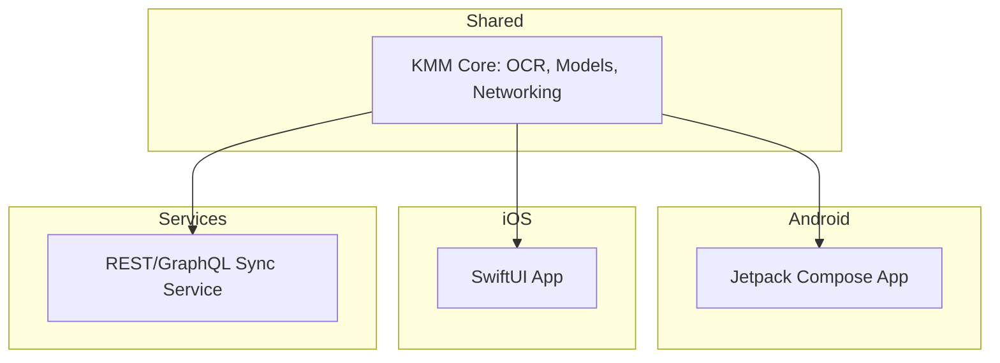

# DexMatic Architecture

DexMatic uses Kotlin Multiplatform to share core logic across Android and iOS. The shared `core` module provides OCR interfaces, data models, and networking logic. Each platform implements its own UI using the shared core.

## Module Diagram

This architecture maximizes shared business logic while allowing each platform to leverage native UI frameworks and capabilities.
